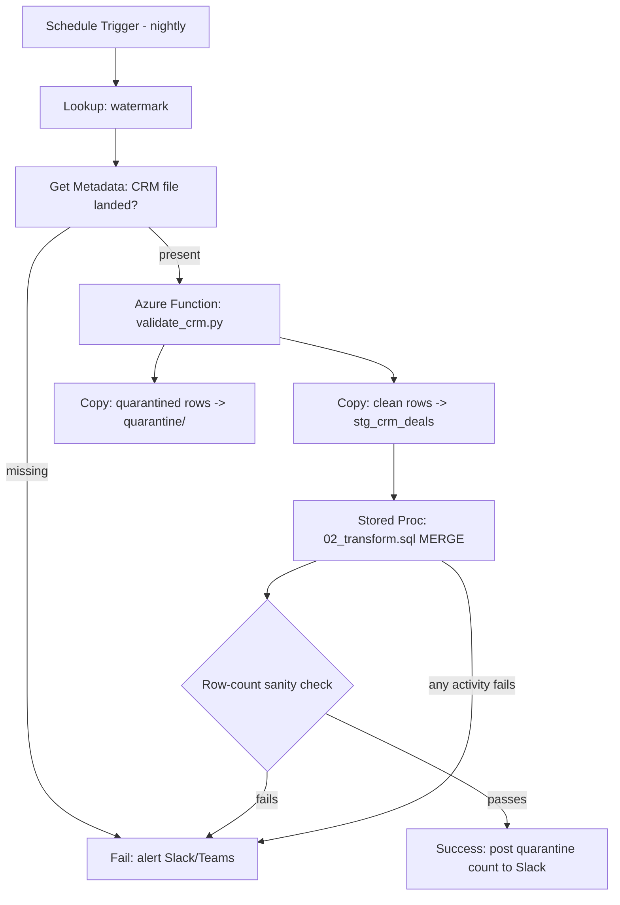

# Ridgeway Growth: Pipeline Health

**The short version:**

- Target table is one row per account per night, with deal value split into open/won/lost instead of one blended number. "Pipeline" should mean live deals, not everything that ever happened.
- The nastiest row in the sample CSV isn't a "dirty data" problem, it's a broken-column problem (an unescaped comma shifts every field after it). I quarantine it instead of guessing. Worth the two minutes to read why, below.
- The slow, wrong Question 2 query had three separate bugs stacked on each other, not one. Fixing only the obvious one wouldn't have fixed the other two.
- Everything here was actually run against a real SQL Server instance and tested with pytest, not just written and hoped for. Real numbers at the bottom.


## Question 1


### 1. Target table

- **Grain:** one row per `account_id`, refreshed nightly as a full snapshot.
- **Columns:** deal counts and values split into open / won / lost, touch activity (count + last touch date), one derived metric, and a load date for trending over time.
- **Derived metric:** `pct_of_portfolio_open_pipeline`, this account's open pipeline as a share of everyone's.
- **Before this goes live, I'd flag:** `deal_value` is commercially sensitive and probably needs row-level security; `account_id` is a join key owned by two different teams, so drift between systems will quietly break touch counts if nobody agrees on a source of truth; and quarantined rows (below) need an actual owner, or bad data just disappears silently instead of getting fixed.

I went with open/won/lost instead of one blended pipeline number because a closed deal isn't pipeline anymore, it's an outcome. Mixing them in would make the account-level total harder to read for no real benefit.

Full DDL with the reasoning in comments: `sql/01_schema.sql`.

### 2. T-SQL + the CSV

- `sql/02_transform.sql` pre-aggregates both staging tables to account grain *before* joining them. Joining first and aggregating after is precisely the bug in Question 2, and I'd already found that problem by the time I got here.
- `python/validate_crm.py` cleans the CSV before staging ever sees it.

The one row worth talking through: `D-1045` has an unescaped comma in a numeric field (`9,800`). That's not a messy value, it's a broken row. Parsed positionally, it shifts every field after it one column over and drops the last one entirely:

```
deal_value:   '9'            <- should be 9800
opened_date:  '800'          <- garbage, not a date
close_date:   '2026-01-02'   <- this was actually opened_date
updated_date: '2026-02-20'   <- this was actually close_date
                                 real updated_date is just gone
```

I only caught this by actually running the parser against the sample and looking at the output. On paper, "strip the comma" sounds like it fixes this, and it doesn't, because the field boundary is already wrong before you get anywhere near the value itself. So the validator checks field count against the header first, and quarantines the whole row if it doesn't match rather than trying to salvage it:

```python
if len(fields) != len(header):
    quarantined_rows.append({..., "_rejection_reason": "FIELD_COUNT_MISMATCH..."})
    continue
```

Same pattern for everything else: missing `account_id`/`deal_id`, a `Closed Won` deal with no value (flagged, not defaulted to $0), dates in either format normalized or quarantined if neither parses. Full logic in `python/validate_crm.py`, tests in `tests/test_validate_crm.py`.

### 3. DAX measure

```dax
Open Pipeline Value =
SUM ( fact_account_pipeline_health[open_pipeline_value] )

Pct of Portfolio Open Pipeline =
DIVIDE (
    [Open Pipeline Value],
    CALCULATE ( [Open Pipeline Value], ALL ( fact_account_pipeline_health[account_id] ) )
)
```

`ALL()` strips just the account filter, so the denominator stays "everyone in the current view" while the numerator stays per-row. `DIVIDE` returns blank instead of erroring when the denominator's zero.

This one has to live in DAX rather than SQL, because it needs to react to how the report's filtered. Slice to EMEA only, and the share should recompute against the EMEA total, not the whole portfolio. The SQL column is only ever correct for the unfiltered view baked in at load time. Power Query, on the other hand, is the right spot for anything that should look the same no matter how the report's sliced: reshaping columns, fixing types, a static account-to-region lookup.

### 4. ADF sketch

I'd use a T-SQL stored procedure here, not Mapping Data Flows or Databricks. Both sources already land somewhere Azure SQL can reach directly, the volumes are modest, and the transform is a couple of CTEs and window functions. Spinning up a Spark cluster for that doesn't buy anything. Worth revisiting if touch history grows into genuinely large territory (see the scaling note under Question 2).

1. Nightly trigger, after the campaign platform's own load finishes.
2. Lookup the last successful load date, so a failed run can't skip or double-process a day.
3. Check today's CSV actually landed, fail loudly rather than run on stale data.
4. Azure Function runs `validate_crm.py`: clean rows go to a landing path, quarantined rows go to their own path with reasons attached.
5. Copy clean rows into `stg_crm_deals` (truncate-and-reload, it's a snapshot).
6. Stored procedure runs the MERGE into `fact_account_pipeline_health`.
7. Sanity check: if today's row count drops more than ~20% versus yesterday, treat that as a failure even though the SQL technically succeeded.
8. Any step fails, webhook to Slack/Teams with the error, so nobody has to go check ADF Monitor every morning.
9. On success, post the quarantine count too. 200 quarantined rows instead of the usual 2 is worth knowing even on a "green" run.




*(if this lands in a Google Doc instead of GitHub, the diagram won't render. Happy to swap it for a screenshot.)*

Re-running the same night twice is safe: the MERGE keys on `(account_id, load_date)`, so it overwrites rather than duplicates.

## Question 2

Full annotated queries in `sql/03_diagnose_and_fix.sql`. Short version: three separate bugs, stacked on top of each other.

- **Join fan-out:** both staging tables are many-rows-per-account, so joining them before aggregating multiplies rows. Two deals × four touches = eight joined rows, so the touch count gets counted once per deal instead of once per account.
- **Wrong grain:** `GROUP BY d.account_id, d.deal_value` groups by *value*, not `deal_id`. Two deals on one account with the same value silently merge into one row. That's a second, independent bug that fixing the join alone wouldn't touch.
- **Non-sargable filter:** `WHERE YEAR(d.updated_date) = 2026` wraps the column in a function, so the optimizer can't seek an index on it and has to evaluate `YEAR()` on every row first. This is most of the two-hour runtime.

Fix: pre-aggregate touches to account grain before joining, group by `account_id` alone, and filter with a date range instead of `YEAR()`.

**Scaling it further:** pre-aggregating per query still means scanning the full touch history every night. At real volume, I'd move to an incremental daily rollup table instead, appended to nightly rather than recomputed from scratch each time. Query and the trade-off (one more table to maintain, in exchange for not re-scanning years of history nightly) are in `03_diagnose_and_fix.sql`. Not worth the extra moving part until touch volume actually makes the full scan the bottleneck.

**Slack update:**

> Fixed the touch-count mismatch and the slow nightly run, turns out they had the same root cause.
>
> • **What was wrong:** the query joined deals straight to touches before aggregating, so any account with more than one deal got its touch count counted once per deal instead of once total. On our test data that's roughly 1 in 5 accounts, not really an edge case. Separately, filtering with `YEAR(updated_date) = 2026` couldn't use the index on that column at all, so every run scanned the whole table. That's the two hours.
>
> • **What changed:** touches get counted per account first, then joined to deals, so the count physically can't multiply. The date filter's now a range instead of wrapping the column in `YEAR()`, so it can use the index again.
>
> • **What to watch:** touch counts should drop for any account with multiple open deals, that's the fix working, not something broken. If total pipeline value changes too, flag it, that number shouldn't have moved.
>
> • **One more thing:** the grain changed from one row per deal to one row per account for this metric. Turns out the old query wasn't reliably at either grain to begin with, thanks to that grouping-by-value bug above. Shout if anything downstream was relying on the old rows.


## How I tested this

Wrote it, then tested every claim instead of trusting it. My first AI-assisted pass at the Python validator described the `D-1045` problem correctly in words but didn't actually catch it in code, which is exactly the kind of gap you only find by running the thing.

- `pytest tests/ -v`: 9 tests, one per edge case, all passing.
- Ran the real schema and transform against a local SQL Server instance, seeded with the 3 rows the validator actually produces plus two extra deals (so at least one account has more than one deal, otherwise the fan-out bug has nothing to bite on):

```sql
INSERT INTO stg_crm_deals (deal_id, account_id, stage, deal_value, opened_date, close_date, updated_date) VALUES
    ('D-1041','ACC-207','Proposal',18500,'2026-01-14','2026-03-02','2026-03-02'),
    ('D-1043','ACC-311','Negotiation',42000,'2026-02-03',NULL,'2026-03-01'),
    ('D-1046','ACC-118','Proposal',15000,'2026-02-14','2026-04-01','2026-03-03'),
    ('D-2001','ACC-207','Negotiation',9000,'2026-02-01',NULL,'2026-03-05'),
    ('D-2002','ACC-118','Discovery',6000,'2026-02-10',NULL,'2026-03-04');
```

  Running the original buggy query against that: `ACC-118` and `ACC-207` both show up twice, each row claiming the account's *full* touch count rather than a share of it. So the fan-out isn't theoretical, I watched it happen. The fixed query returns exactly one row per account, matching the real counts.

- **At scale:** generated ~20,000 synthetic deals and a million synthetic touches to see if this holds up at something closer to production volume. It does: the buggy query returned 2,783 rows for what should've been 2,307 distinct accounts, and 453 accounts (about 1 in 5 active that year) would show a doubled touch count if a dashboard summed the buggy output to account level. With an index on `updated_date`, the execution plan confirmed the mechanism behind the runtime directly: the range filter seeks the index, `YEAR(...)` still forces a full scan on the exact same index. Invisible at 20K rows, but that gap is exactly what turns into two hours once the table's real-world sized.

